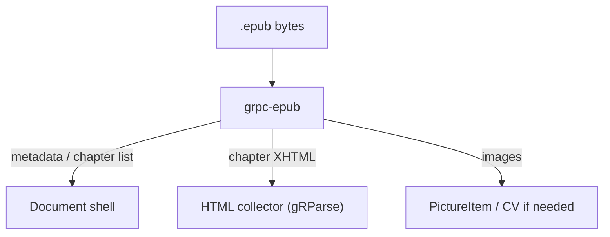

# grpc-epub architecture

**Status:** implemented
**Updated:** 2026-08-15

Implementers start at [`AGENTS.md`](../AGENTS.md), then this file, `design.md`, and `guidelines.md`.

## Where this sits

An EPUB is a ZIP of XHTML plus an OPF spine. This service unpacks the archive
in memory, walks the spine in order, and streams the pieces out as typed
events. No temp dir, no disk.

This process is deliberately thin. It owns packaging, not HTML semantics.

## Live results

`EpubInfo` (title, spine length) goes out immediately, then each chapter's
XHTML as that zip entry is read, so a UI can show chapter 1 while chapter 12 is
still in the archive. Images stream as `Resource` events when their entries are
hit, not at the end. `ParseStatus` is a trailer.

## What this process owns

- ZIP bomb limits (entry count, uncompressed cap, nested zip refused), enforced
  in memory.
- `META-INF/container.xml` to OPF to metadata (title, creators, language,
  identifiers) and the spine order.
- Streaming each spine item's bytes as a chapter event.
- Resolving internal image paths to bytes for `ImageRef`s the HTML mapper can
  attach.

## What this process does not own

| Concern | Owner |
|---|---|
| HTML reading order, headings, tables, links | HTML collector |
| CSS layout / pagination | out of scope (EPUBs are reflow) |
| DRM / Adobe ADE | `UNIMPLEMENTED` |
| Export to a new EPUB | protomolt, maybe never |

## Language

Rust. `zip` crate over `Cursor<&[u8]>`, XML via `quick-xml` for container/OPF
only. No filesystem. Matches `grpc-calamine` and `grpc-lol-html` operationally:
diskless, streaming, read-only container.
